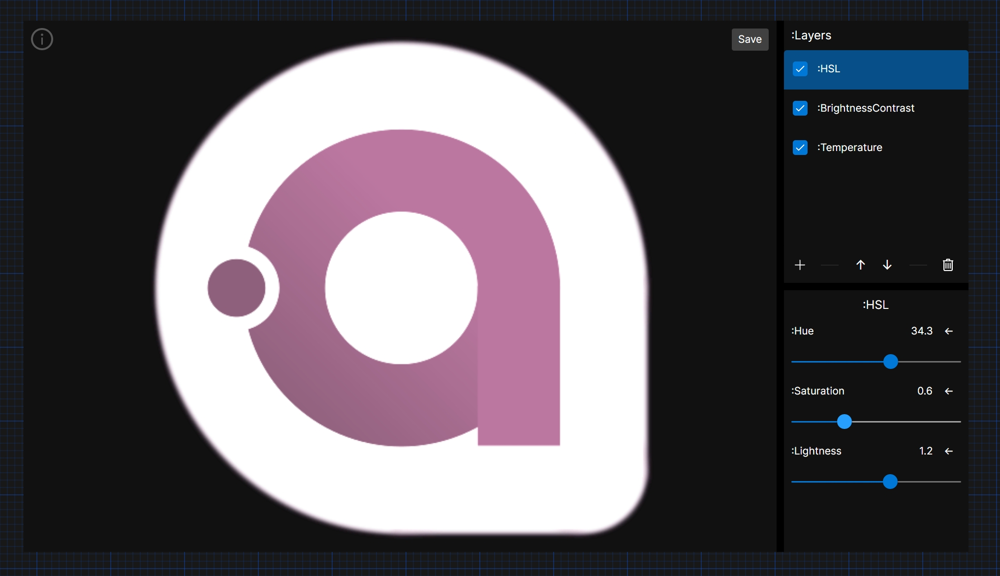

## VirtualStreetSnap

VirtualStreetSnap is a screenshot tool for save virtual street view basic on avaloniaui.

Compare to other screenshot tool, VirtualStreetSnap provide a more camera-like experience.





### Features

> v0.0.8

+ Radio button: select different size of screenshot.
    + 4:3 16:9 3:2 9:16 3:4 1:1

+ Overlays
    + red focus border for indicate the screenshot area.
    + guidelines for help align the screenshot area.
        + grid
        + center
        + ratio

+ Settings
    + on top: always on top.
    + file prefix: custom file prefix for saving screenshot.
    + save directory: custom save directory for saving screenshots.
    + translation\[en/zh\]: change the language

+ Image gallery: review the screenshot.
    + Image viewer: view the screenshot.
        + flip the image.
        + scroll to zoom the image.
        + middle/left click to drag the image.
        + copy the image to clipboard.
        + pick the color from the image, and copy the color to clipboard.
    + Thumbnail viewer: view the thumbnail.
        + right click thumbnail to delete/open in explorer.
        + scroll to view more thumbnails.
        + async load thumbnail.
        + grab to fill the window.
  
+ Image Editor
  + simple adjust layer system
    + add / move / delete layer; save and load with the gallery.
    + layer type
      + hsl
      + brightness/contrast
      + temperature
      + tint
      + sharpen

### Download

[Releases](https://github.com/atticus-lv/VirtualStreetSnap/releases)

### Development

Environment

+ .net 8.0 (C# 12.0)
+ win10 x64

Build (aot by default)
```
dotnet publish
```