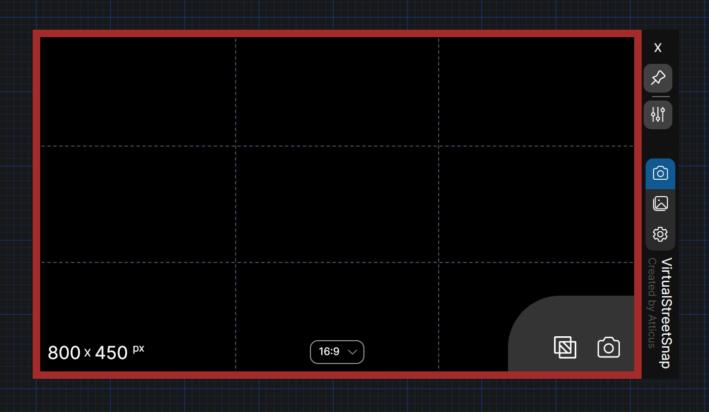
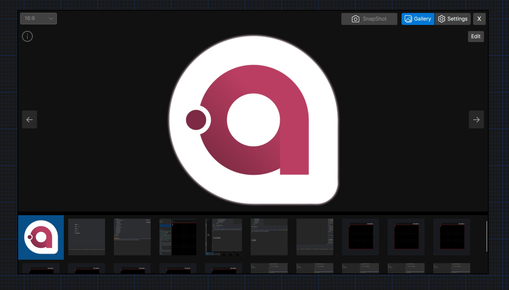
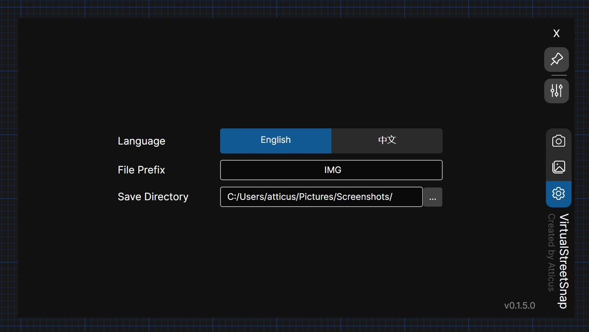
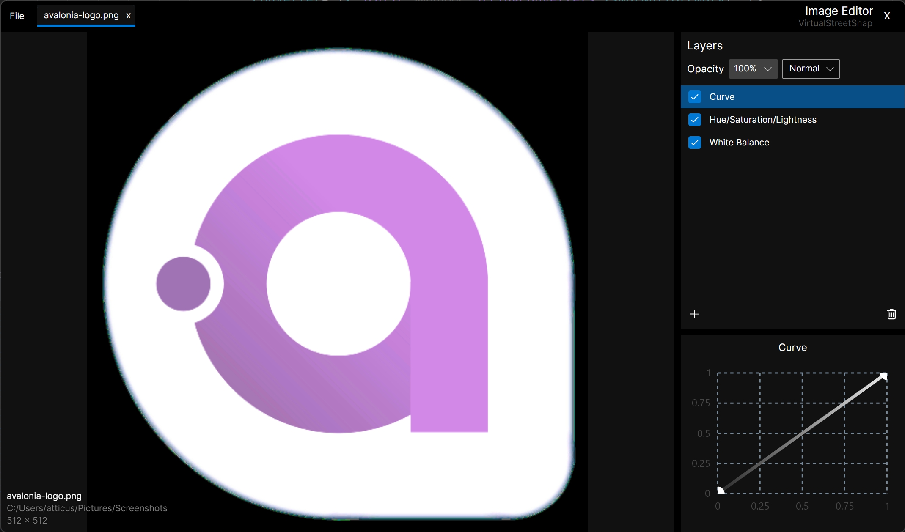
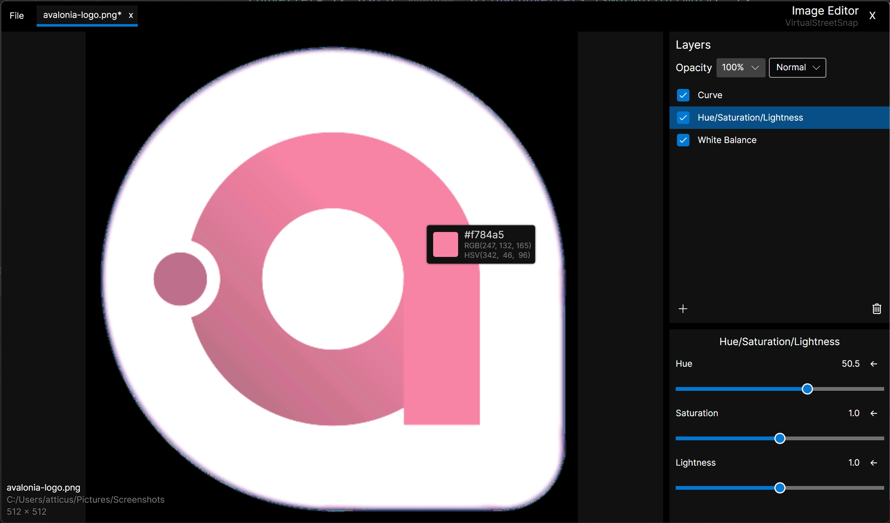

## VirtualStreetSnap

English/[中文](README.zh.md)

VirtualStreetSnap is a screenshot tool for save virtual street view basic on avaloniaui.

Compare to other screenshot tool, VirtualStreetSnap provide a more camera-like experience.











### Features

> v0.1.5

+ SnapShot view
    + Radio button: select different size of screenshot.
        + 4:3 16:9 3:2 9:16 3:4 1:1
    + Enter size (corner display)
    + Overlays
        + red focus border for indicate the screenshot area.
        + guidelines for help align the screenshot area.
            + grid
            + center
            + ratio

    + on top: always on top.


+ Settings
    + translation\[en/zh\]: change the language
    + file prefix: custom file prefix for saving screenshot.
    + save directory: custom save directory for saving screenshots.

+ Image gallery: review the screenshot.
    + Image viewer: view the screenshot.
        + flip the image.
        + scroll to zoom the image.
        + middle/left click to drag the image.
        + pick the color from the image, and copy the color to clipboard.
    + Thumbnail viewer: view the thumbnail.
        + right click menu
            + delete/open in explorer.
            + copy the image to clipboard.
            + scroll to view more thumbnails.
            + Send Image to Editor.
        + grab to ajust the window.

+ Image Editor
    + simple adjust layer system
        + add / delete layer; save and load with the gallery.
        + drag and drop to adjust the layer order.
        + layer (Realtime preview)
            + hsl
            + brightness/contrast
            + white balance(temperature/tint)
            + sharpen/blur
            + vignette
            + pixelate
            + curve

### Download

[Releases](https://github.com/atticus-lv/VirtualStreetSnap/releases)

### Development

Environment

+ .net 8.0 (C# 12.0)
+ win10 x64

Build (aot by default)

```
dotnet publish
```