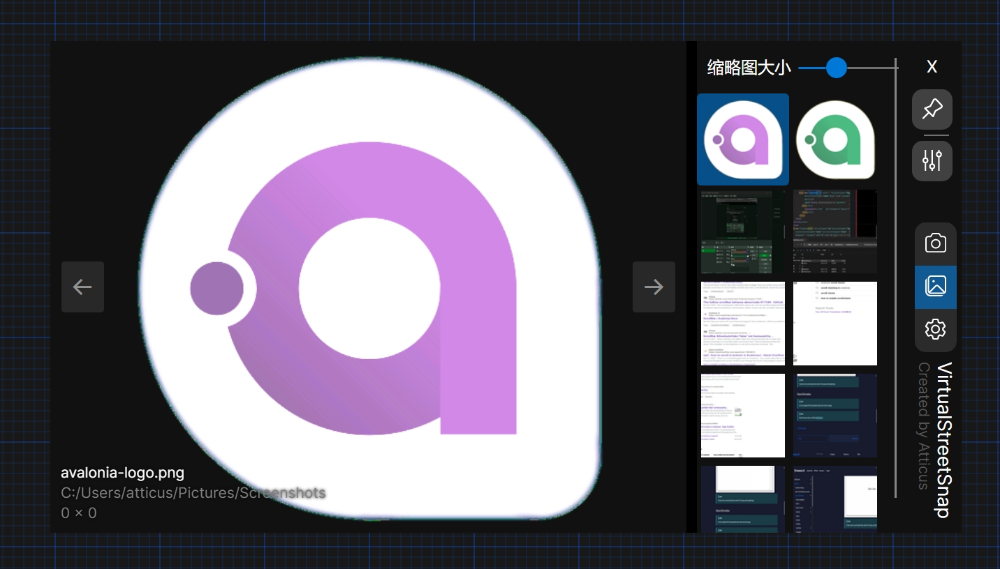
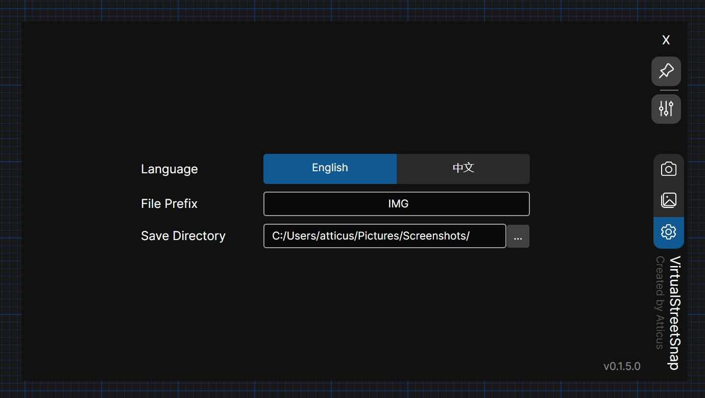
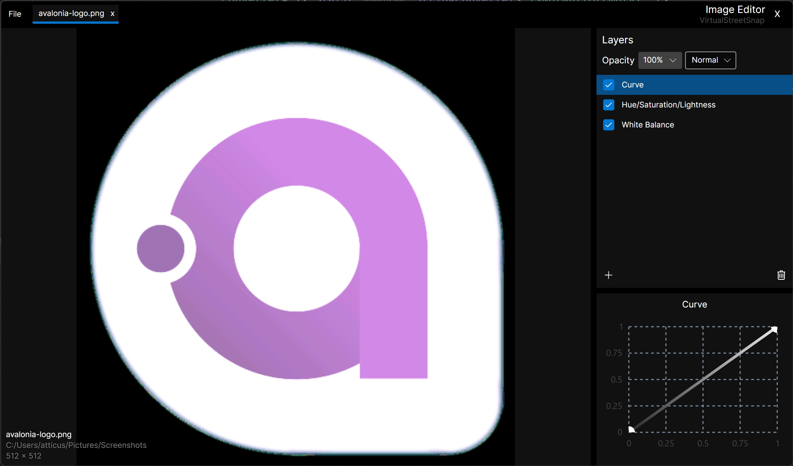
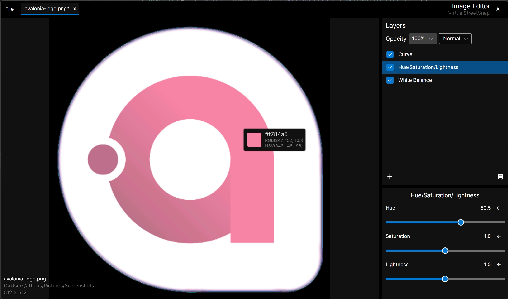

## VirtualStreetSnap

VirtualStreetSnap 是一个基于 avaloniaui 上保存虚拟街景基础的屏幕截图工具。

与其他屏幕截图工具相比，VirtualStreetSnap 提供了更像相机的体验。










### 功能
[English](README.md)/中文
> v0.1.5

+ SnapShot 视图
    + 按钮：选择不同比例的屏幕截图。
        + 4:3 16:9 3:2 9:16 3:4 1:1
    + 输入大小（左下角显示）
    + 叠加层
        + 红色高亮边框表示屏幕截图区域。
        + 帮助对齐屏幕截图区域的指南。
            + 网格
            + 中心
            + 比例

+ 在顶部：始终在顶部。


+ 设置
    + 翻译\[English\中文\]：更改语言
    + 文件前缀：用于保存屏幕截图的自定义文件前缀。
    + 保存目录：用于保存屏幕截图的自定义保存目录。

+ 图片库：查看屏幕截图。
    + 图像查看器：查看屏幕截图。
        + 翻转图像。
        + 滚动以缩放图像。
        + 单击鼠标中键/左键可拖动图像。
        + 从图像中选择颜色，然后将颜色复制到剪贴板。
    + 缩略图查看器：查看缩略图。
        + 右键菜单
            + 在资源管理器中删除/打开。
            + 将图像复制到剪贴板。
            + 滚动以查看更多缩略图。
            + 将图像发送到编辑器。
        + 可调整尺寸。

+ 图像编辑器
    + 简单的调整图层系统
        + 添加 / 删除图层;保存到图片库。
        + 拖放以调整图层顺序。
        + 图层（实时预览）
            + HSL
            + 亮度/对比度
            + 白平衡（色温/色调）
            + 锐化/模糊
            + 晕影
            + 像素化
            + 曲线

### 下载

[Releases](https://github.com/atticus-lv/VirtualStreetSnap/releases)

### 开发

环境

+ .net 8.0 (C# 12.0)
+ win10 x64

构建 (默认启用aot编译)

```
dotnet publish
```